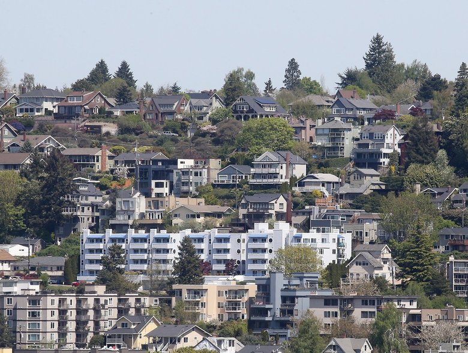

# King County House Data Analysis 

Author: Gamze Turan

## Overview

The King County Real State Agency that helps homeowners buy and/or sell homes.The Real State agency need an advice to homeowners about how home renovations might increase the estimated value of their homes.

## Business Problem

In this analyis I will focus on the renovation of the house impact on the price

## Data

The King County Sales Data covers most of the aspect of the purchasing houses. Price, square feet living, square feet lot etc. In the data I will start with Linear Regression basic model, evaluate it, and then I will provide justification for and proceed to a new model. Based on the results, I will discuss two features that have strong relationships with housing prices.Does the renovation has impact on the house prices?

## Result

## Conclusion

## For More Information
See the full analysis in the Jupyter Notebook or review this presentation.

For additional info, contact Gamze Turan at ginaturan15@gmail.com

## Repository Structure 

├── data
├── images
├── README.md
├── kc_house_data_analysis_Presentation.pdf
└── kc_house_data_analysis.ipynb