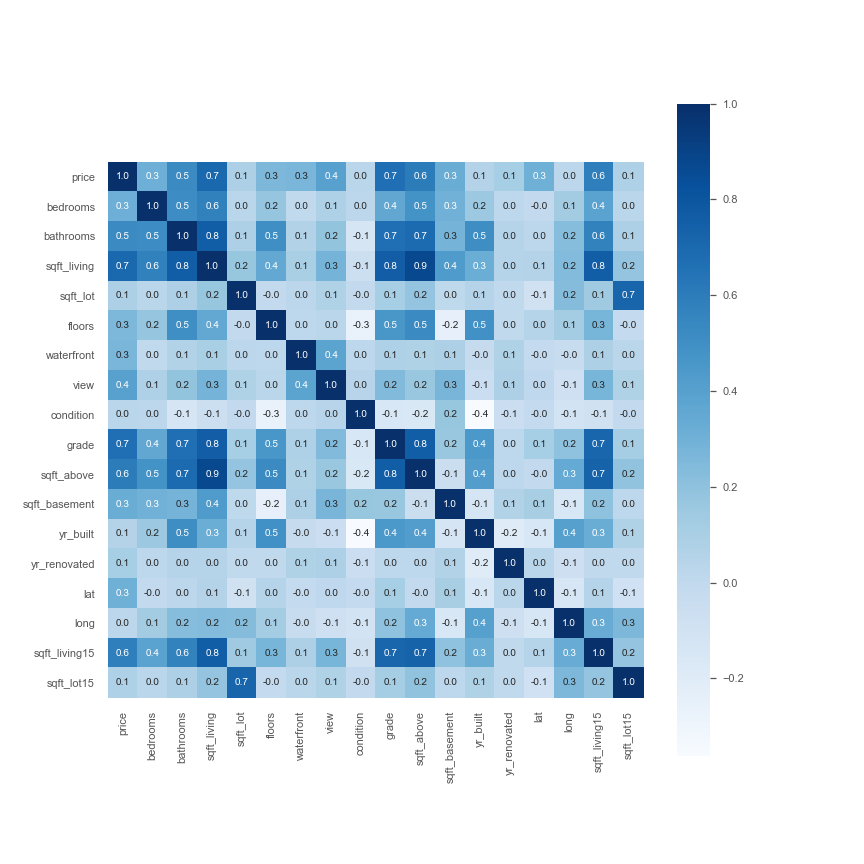

# King County House Data Analysis 

Author: Gamze Turan

## Overview

The King County Real State Agency that helps homeowners buy and/or sell homes.The Real State agency need an advice to homeowners about what are the impact on the house prices.

## Business Problem

In this analyis I will focus on the helping Real state Agency finding what indicater drive prices in house market.

## Data

The King County Sales Data covers most of the aspect that may impact on the house prices. Such as house prices, square feet living, bedrooms and batrooms etc. In the data I will start with Linear Regression basic model, evaluate it, and then I will provide justification for and proceed to a new model. Based on the results, I will discuss two features that have strong relationships with housing prices. What are the impact on the house prices?

## Methods

I performed multiple linear regression after cleaning and testing the data. The cleaning process start with formatting columns so the model can read the data and dropping predictors that are too correlated. I check the price and predictors disribution for the better understanding the relationship in the data. Then I buit a model with the price column as the dependent variable and the highest correlated predictor sqft_above then I used a Q-Q plot graph and a scatter plot graph to see if the data in the relationship was distributed normally. After I built a model out of the full cleaned data frame and got a high R-squared but the graphs showed the data still wasn't normally distributed. I built an other model with and replaced the price dependent variable with a log of the price column and that finally made the data distribute normally.

## Result

#### Base Model

The base model shows that sqft_above(independent variable) has high correlation with price(dependent variable). In Basic linear model high R-squared value (0.80) and low P-value(0) shows there is a relationship between variables. Q-Q data plot is not normally distributed and scatter plots are very homoscedastic.However this model is inconclusive because there is not enough data and sqft_living is too highly correlated with the other predictors.

#### Model1

The first model R-squared value is 0.90 which is higher then my basic model(.79).P-value for each feature in the first model is 0. The scatter plot is a lot more homoscedastic than the basic model and the Q-Q plot still shows that the data is not normally distributed. I can assume that house price increases in a non-linear fashion.

### Final Model

On the final model the R-squared score dropped to 0.765 and all predictors in the final dataframe have a low p-value. The Q-Q plot shows the model is normally distributed and the scatter plot shows the data is homoscedastic.

## Conclusion

- Comparing the base and final model our R-square value has dropped from 0.90 to 0.76. Also the base model wasnt normally distributed.In the - final model using log transform help makes the model normally distributed.
- The latitude coefficient is 1.2565 which means I assume, if the house around the common areas the property the price should be higher than other areas.
- The waterfront coefficent is 0.3791 and the second highest, if the house is waterfront property the price should be considerably higher than if it was not waterfront
- The King county grading system also impacted the house price. The coeffient is 0.1830 meaning it's the fourth most important feature.
- The sqft_above column was the highest correlated with price and increase house value.Bigger the houses the more they cost.

## For More Information
See the full analysis in the Jupyter Notebook or review this presentation.

For additional info, contact Gamze Turan at ginaturan15@gmail.com

## Repository Structure 

├── data

├── images

├── README.md

├── kc_house_data_analysis_Presentation.pdf

└── kc_house_data_analysis.ipynb